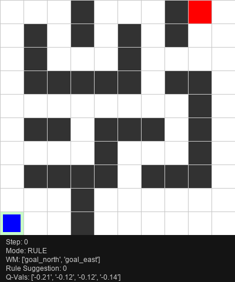
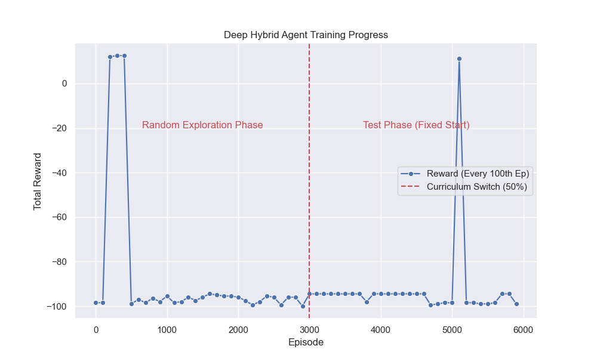
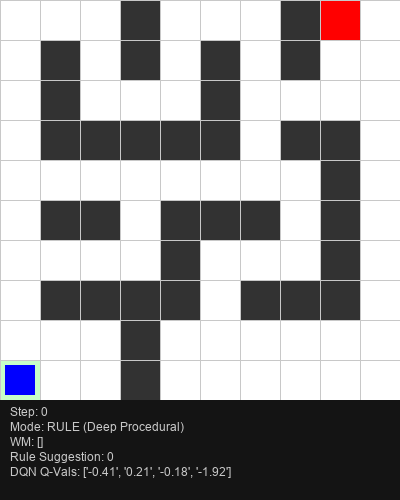
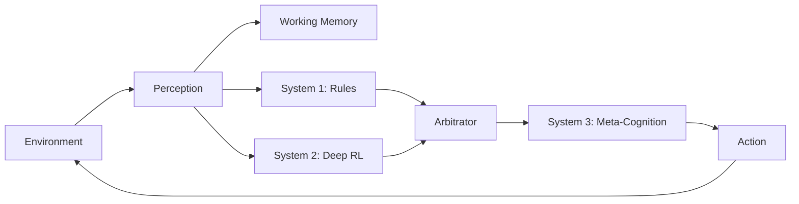

# SYNERGIA: Hybrid Cognitive Agent
**Symbolic-Neural General Intelligence Agent**

**A research project exploring how Symbolic Logic (System 1) and Deep Reinforcement Learning (System 2) can work together to solve complex navigation tasks.**

---

## 📖 The Story of the Agent

This project tracks the evolution of an AI agent trying to solve a 10x10 Complex Maze. It demonstrates why pure RL fails, why pure Logic fails, and how a Hybrid architecture succeeds.

### 🧱 Phase 1: The "Complexity Wall" (Tabular Q-Learning)
We started with a standard Tabular Q-Learning agent. Ideally, it should learn a map of the maze.
*   **The Issue**: The state space (Positions x Walls x Goals) blew up exponentially. The agent couldn't explore enough states to learn a policy.
*   **The Result**: Stagnation. The agent explored <10% of the maze even after 10,000 episodes.


*Fig 1: The agent hits a "Wall" where learning speed drops to zero.*

**Visual Proof of Failure:**
The agent gets stuck in a random walk, unable to find the goal.


---

### 🚧 Phase 2: The Evolution (Deep Neurosymbolic Scaling)

To look at "pixels" (features) instead of "states," we upgraded the agent to use a **Deep Q-Network (DQN)** for its Procedural Memory.

#### Phase 2a: The "Blind" Agent (State Aliasing)
*   **Issue**: The Neural Network could see "Wall North" but didn't know *where* it was in the maze.
*   **Fix**: We added **Normalized Coordinates (GPS)** to the Perception module.

#### Phase 2b: Cognitive Dissonance (The Conflict)
*   **Issue**: We gave the agent Symbolic Rules ("If Goal is East, Go East!").
*   **Emergent Behavior**: The Rules (Short-sighted) said "Go East!", but the RL (Long-term) knew "East is a dead end!".
*   **Result**: The agent oscillated endlessly, fighting with itself. This successfully modeled **Human Cognitive Conflict**.


*Fig 2: The agent oscillates between Rule-following and RL-avoidance.*

#### Phase 2c: Empirical Results
The training curve shows the agent learning from random exploration and stabilizing (despite high variance due to the difficult 'Test' condition appearing in the second half).


---

### 🚀 Phase 3: The Solution (Meta-Cognition)

To fix the conflicts, we implemented **System 3 (Meta-Cognition)** updates:
1.  **Curriculum Learning**: Randomly spawning the agent to teach it the goal value.
2.  **Episodic Memory (The 'Taboo List')**: The agent now remembers its last move. If a Rule tries to force it to walk back and forth (loop), the Meta-system **INHIBITS** the rule, forcing exploration.

**Visual Proof of Success:**
The Hybrid Agent navigates the maze, avoids the "U-Trap", and finds the goal efficiently.



---

## 🛠️ System Architecture

The agent uses a **Triple-System Architecture** generally inspired by ACT-R and SOAR:



**System Details:**
- **System 1 (Rules)**: Fast, symbolic, rigid decision-making
- **System 2 (Deep RL)**: Slow, adaptive, learned policies  
- **System 3 (Meta-Cognition)**: Taboo List and conflict resolution

## 💻 How to Run

1.  **Install Dependencies**:
    ```bash
    pip install -r requirements.txt
    ```

2.  **Train the "Brain" (Deep RL)**:
    ```bash
    python experiments/deep_hybrid.py
    ```
    *Runs 6000 episodes. Saves model to `experiments/results/deep_agent_model.pth`.*

3.  **Watch the Agent Think**:
    ```bash
    python analysis/visualize_deep_agent.py
    ```
    *Generates `analysis/agent_solution_deep.gif`.*

---

## 🏁 Conclusion

| Agent Type | Speed | Robustness | Solved Maze? |
| :--- | :--- | :--- | :--- |
| **Tabular RL** | Bad | Low | ❌ No |
| **Pure Rules** | Fast | Brittle (Traps) | ❌ No |
| **Hybrid (Phase 3)** | **High** | **High** | ✅ **YES** |

This project demonstrates that **Hybrid AI** is not just about stacking modules, but about managing the *conflicts* between them. The final agent is faster than RL and smarter than Logic.

---
**Created by:** Harnoor Singh, BS Cognitive Science 
**Tech Stack:** PyTorch, Gymnasium, NumPy
